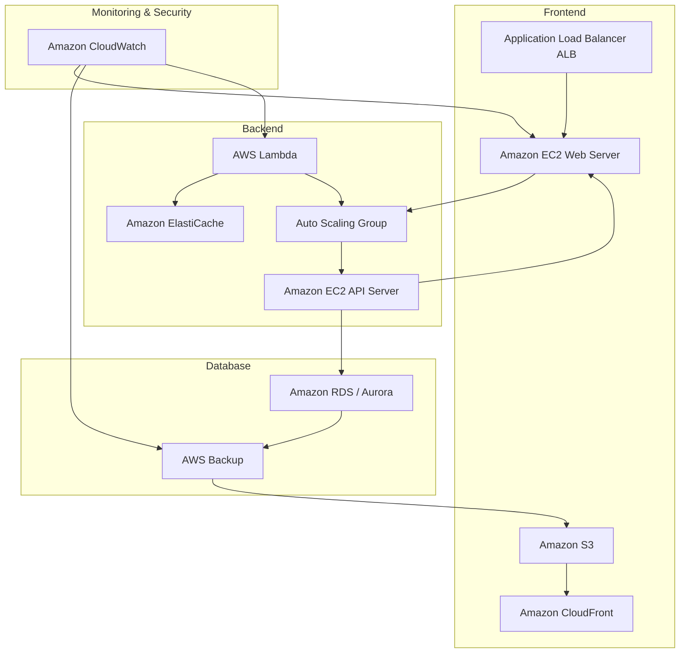

### Lab 5 Rehosting a 3-Tier eCommerce Application to AWS

## Architecture Diagram

### Scalability

The target architecture is designed to be highly scalable, accommodating fluctuating workloads efficiently. By implementing an **Auto Scaling Group** for the backend API servers, the system can automatically adjust the number of EC2 instances based on real-time traffic demands. This ensures that the application can handle sudden spikes in user requests without performance degradation. Additionally, the use of **Amazon RDS** for the SQL database allows for read replicas and horizontal scaling, enabling the database tier to efficiently manage increased query loads. Furthermore, the integration of **Application Load Balancer (ALB)** for the frontend web servers ensures that incoming requests are evenly distributed across multiple instances, preventing any single server from becoming a bottleneck. Overall, this architecture can seamlessly grow to meet user demands while maintaining optimal performance.

### Availability

To enhance availability, the architecture employs multiple strategies. The use of **Amazon RDS with Multi-AZ deployment** ensures that the database remains operational even in the event of a failure in one availability zone. This setup provides automatic failover to a standby instance, minimizing downtime and ensuring that the application remains accessible. Additionally, the **Application Load Balancer** distributes incoming traffic among healthy EC2 instances, allowing for continuous service even if one or more instances experience issues. The frontend web server infrastructure hosted on **Amazon S3** and **CloudFront** further increases availability by serving static content from edge locations, reducing latency and ensuring high accessibility for users around the globe.

### Disaster Recovery

The architecture incorporates a robust disaster recovery plan to safeguard against data loss and ensure business continuity. Regular backups are configured for the **Amazon RDS** instances using **AWS Backup**, allowing for point-in-time recovery in case of accidental data loss or corruption. The implementation of an **Auto Scaling Group** for the backend servers means that new instances can be rapidly launched in response to system failures, ensuring that application services are quickly restored. Furthermore, the architecture's reliance on multiple availability zones for both compute and database services ensures that even in the event of a significant failure, the system can recover with minimal disruption. By leveraging AWS's built-in redundancy and backup capabilities, the architecture effectively mitigates risks associated with data loss and service interruptions.

---

### 2. Step-by-Step Breakdown of the Migration Process
Here’s an updated version of the migration report that includes the Virtual Private Cloud (VPC) in the diagram and text. 

### Migration Process Report

### Step 1: Assessment and Planning

The migration process begins with a thorough assessment of the current application architecture, identifying components such as the frontend web server, backend API server, and SQL database. This stage includes creating an inventory of dependencies and integrations, determining the AWS services to use, defining security requirements, estimating costs, and establishing a migration timeline. This planning phase is crucial for minimizing risks and ensuring a smooth transition.

### Step 2: Setting Up the AWS Environment

After planning, the next step is to set up the AWS environment. This involves creating an AWS account and configuring the Virtual Private Cloud (VPC), which includes establishing subnets, route tables, and security groups for high availability and fault tolerance. Provision and configure necessary AWS services like EC2 for web and API servers, RDS for the database, and CloudFront for content delivery according to the architectural design.

### Step 3: Data Migration Preparation

Before migrating data, it’s important to ensure data integrity and consistency. Analyze the existing database structure and decide on the best data transfer method, which might include using AWS Database Migration Service (DMS) or native tools. Backing up the current database is essential to prevent data loss, and a testing plan should be developed to validate data post-migration.

### Step 4: Migrating the Application Components

Next, migrate the application components by deploying the frontend web server on EC2 and configuring the environment (Apache/Nginx). Then, deploy the backend API server on another EC2 instance within an Auto Scaling Group. Initiate the data migration process to Amazon RDS or Aurora, monitoring closely for any issues during this phase.

### Step 5: Testing the Application

Once migration is complete, conduct thorough testing to ensure functionality, performance, and security. This includes validating that the application behaves as expected and meets load requirements. Performance should be compared to the on-premises setup, and failover scenarios should be tested to confirm alignment with the disaster recovery strategy.

### Step 6: Cutover and Go Live

The final step is to cut over to the AWS environment, switching traffic from the on-premises application to the new setup. This should occur during a scheduled maintenance window, with DNS records updated to point to the new environment. Closely monitor the application for any issues during this phase and follow a go-live checklist to ensure everything is functioning correctly.

### Step 7: Post-Migration Monitoring and Rollback Strategy

After migration, continuously monitor the application using Amazon CloudWatch for performance and availability. Implement a rollback strategy to revert to the on-premises system temporarily if critical issues arise. Regular backups of the new AWS environment should also be configured to ensure recovery in case of unforeseen incidents.

